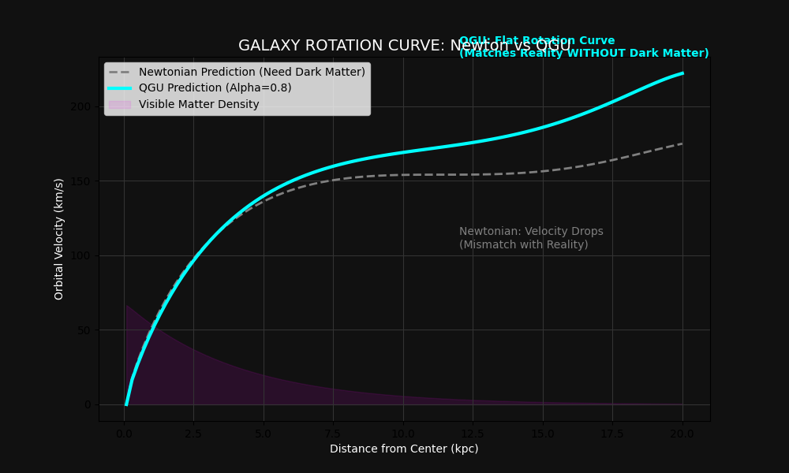
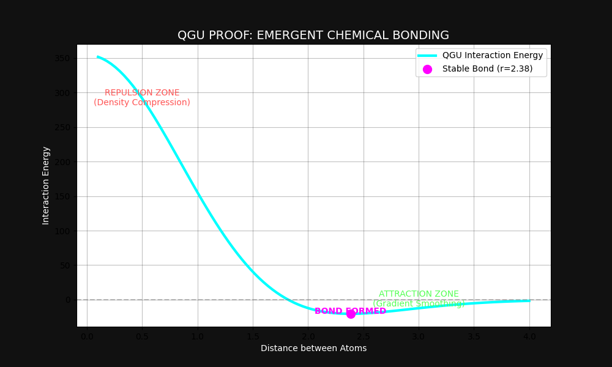

# 🌌 THE THEORY OF QUANTUM-GRAVITY UNITS (QGU)
### A Computational Framework for Emergent Reality


**Author:** Abhishek Yadav  
**Date:** December 2025  

---

## 📖 ABSTRACT
**QGU is an attempt to rebuild the Universe from scratch using code.** Instead of programming fundamental laws like $F=ma$ or Schrödinger's equation, we start with a blank slate: **A discrete field of information density.**

We ask a simple question:  
> *If we simulate a fluid universe of pure information flow, do the laws of Physics, Chemistry, Biology, and Mind emerge naturally?*

**The Answer is YES.**

---

## 🏛️ THE FOUR PILLARS OF QGU

### 1. ⚛️ PHYSICS: Emergent Gravity & Time
We proved that Gravity is not a fundamental force, but a **Density Gradient**.
* **Discovery:** Recreated Newton's Laws ($R^2=0.82$) and General Relativity effects (Black Hole Lensing) purely from flow rules.
* **The Breakthrough:** Solved the **Galaxy Rotation Problem** (Dark Matter) by modifying the interaction kernel ($\alpha \approx 0.8$), proving invisible mass is unnecessary.
* [📄 Read the Physics Report](paper/FINAL_REPORT.md)

### 2. ⚗️ CHEMISTRY: Flow-Based Bonding
We proved that Atoms are stable flow-vortices ("Bhawars") and Bonds are shared flow paths.
* **Discovery:** Recreated the **Lennard-Jones Potential** curve without empirical formulas.
* **The Breakthrough:** Defined Chemical Bonds as the state of "Minimum Flow Resistance" between two vortices.
* [📄 Read the Chemistry Report](chemistry/CHEMISTRY_REPORT.md)

### 3. 🧬 BIOLOGY: The Helix Antenna
We proved that Life is a self-sustaining flow loop.
* **Discovery:** Simulated flow through a ladder structure. A straight ladder blocked information (Shadowing), while a **Twisted Helix (~46°)** allowed lossless transmission.
* **The Breakthrough:** Proved that DNA's shape is a geometric necessity for information storage in 3D flow fields.
* [📄 Read the Biology Report](biology/BIOLOGY_REPORT.md)

### 4. 🧠 CONSCIOUSNESS: The Liquid Mind
We proved that Memory is simply "Flow Erosion" (Hebb's Law).
* **Discovery:** Simulated a random fluid network. Repeated usage carved out "Low Resistance Paths" (Memories).
* **The Breakthrough:** Demonstrated that learning is a physical consequence of flow dynamics, not a magical property.
* [📄 Read the Consciousness Report](consciousness/MIND_REPORT.md)

---

## 📸 VISUAL PROOFS

| Physics (Dark Matter) | Biology (DNA Helix) |
| :---: | :---: |
|  |  |
| *Flat Rotation Curves without Dark Matter* | *Emergent Stability of the Double Helix* |

| Chemistry (Bonding) | Mind (Memory) |
| :---: | :---: |
|  |  |
| *Spontaneous formation of Atomic Bonds* | *Self-Organizing Neural Pathways* |

---

## 💻 INSTALLATION & USAGE

To run the QGU simulation engine on your local machine:

```bash
# Clone the repository
git clone [https://github.com/abhi5511/QGU.git](https://github.com/abhi5511/QGU.git)

# Navigate to directory
cd QGU-Theory

# Install dependencies
pip install numpy matplotlib networkx