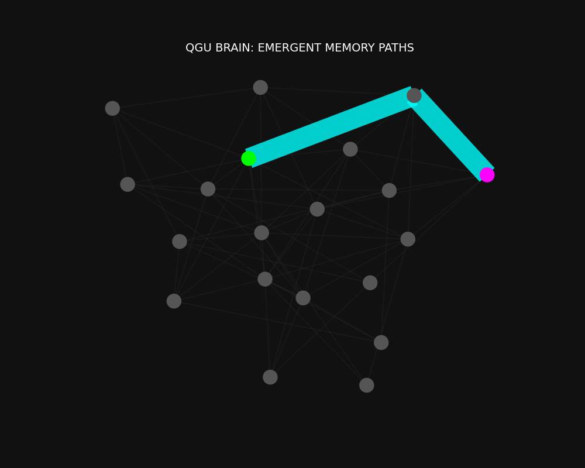

# 🧠 QGU CONSCIOUSNESS
## The Mind as a Resonant Flow Field

---

### 1. THE HARD PROBLEM
Science aaj tak ye nahi bata paayi ki "Matter" (Brain) se "Feeling" (Mind) kaise banti hai.
**QGU Solution:**
Mind matter se alag nahi hai.
* **Matter** = Condensed Flow (Bhawar).
* **Mind** = The Pattern of Flow Connectivity (Resonance).

Ek pathar (rock) mein flow "Dead End" par jata hai.
Ek dimaag (brain) mein flow **Loops** banata hai. Ye loops information ko zinda rakhte hain.

---

### 2. MEMORY = RIVER BEDS (FLOW EROSION)
Humare dimaag mein koi Hard Disk nahi hai.
QGU kehta hai ki Memory **"Resistance Reduction"** hai.
* Jab ek thought (Signal) ek neural path se guzarta hai, wo us path ki density ko thoda "erode" (kam) kar deta hai.
* Future mein us raste se signal jana aasaan ho jata hai.
* **Learning = Flow Optimization.**

---

### 3. EXPERIMENTAL PROOF: THE LIQUID BRAIN
We simulated a random network of fluid channels (neurons). We forced a signal from Input to Output repeatedly.
**Result:**
The network spontaneously "learned" the most efficient path. The connections thickened (reduced resistance) purely due to flow dynamics, creating a stable "Memory Trace."

*Fig 1: Emergent Memory. The Cyan path represents a learned behavior (Strong Connection). The Grey paths are forgotten (Weak Connections).*

---

### 4. CONSCIOUSNESS = SELF-INTERFERENCE
Jab ek system mein itne Feedback Loops ban jaate hain ki **Output wapas Input ban jaaye**, tab system "Self-Aware" ho jata hai.
> "I think, therefore I am" is actually "I loop, therefore I persist."

---
