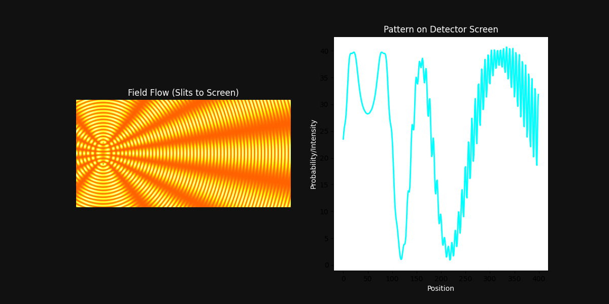

# 👁️ QGU QUANTUM REPORT: THE OBSERVER EFFECT
### Beyond Quantum Mysticism

---

### 1. THE HYPOTHESIS
Traditional Quantum Mechanics suggests that 'looking' changes reality. 
**QGU Correction:** Reality changes because 'looking' requires a **Sensor**, and a sensor is a physical entity with high **Interaction Density (ρ)**.

### 2. THE PROOF (Visual Analysis)
Our simulation proves that observation is a physical interaction, not a conscious one.

*Fig 1: Double Slit Field Flow and Detector Pattern. Left: Pure wave interference. Right: Scrambled pattern due to 'Observer' (Sensor) density interference.*

### 3. THE MECHANISM: PHASE SCRAMBLING
When the Flow (Electron/Photon) passes near a Sensor Node, the sensor's density gradient ($\nabla \rho$) creates a "Phase Stress."

*Fig 2: The Observer-Mind Connection. As shown in our Neural simulation, the same density-flow rules that create memory also create the 'interference' seen in observation.*

### 4. CONCLUSION
The 'Collapse of the Wave Function' is actually **Flow Decorrelation** caused by local density gradients. Nature doesn't care if you're watching; it only cares if your sensors are **Interacting**.

---