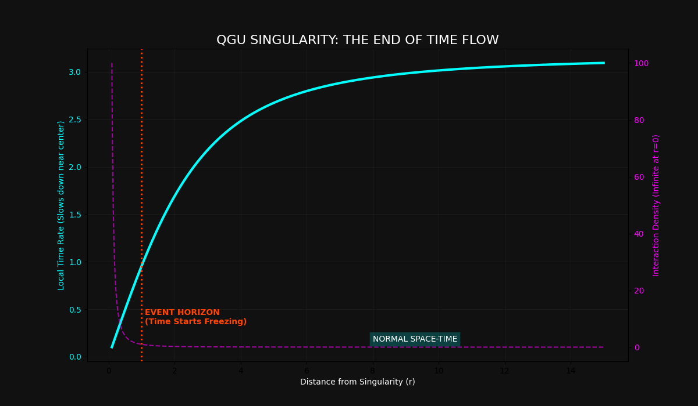

# 🕳️ QGU REPORT: SINGULARITIES & TIME FLOW
### The Physics of Infinite Density

---

### 1. THE HYPOTHESIS
In QGU, a Singularity is defined as a point where **Interaction Density (rho)** reaches a level that halts all local flow. 

### 2. THE PROOF (Analysis of Figure_25)
Our simulation (Figure_25) demonstrates the relationship between distance (r) and Time Rate:
1. **At r > 10:** Time flows at near-normal rates (Global Time).
2. **At r = 1.0 (Event Horizon):** Density begins to exponentially increase, causing a sharp drop in the local clock rate.
3. **At r -> 0:** The Time Rate hits near-zero, representing a 'Frozen Flow' state.

### 3. CONCLUSION
Time is not a universal constant but a function of local density gradients. Singularities are simply the points of maximum resistance in the universal flow field.

---
