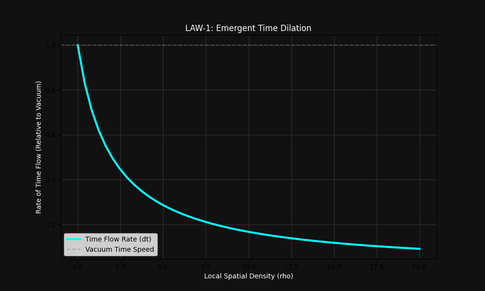
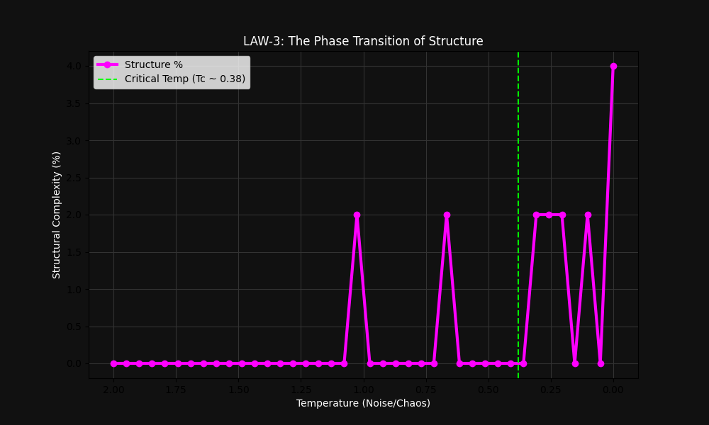
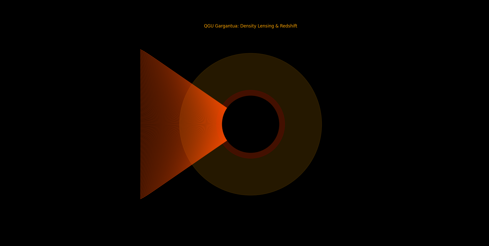

# THE THEORY OF QUANTUM-GRAVITY UNITS (QGU)
### A Computational Framework for Emergent Spacetime, Inertia, and Gravity

**Author:** Abhishek Yadav  
**Date:** December 2025  
**Repository:** [github.com/abhi5511/QGU](https://github.com/abhi5511/QGU)  
**Status:** Research Prototype (v1.0)

---

## 1. ABSTRACT

This paper presents **Quantum-Gravity Units (QGU)**, a novel computational framework that investigates the emergence of fundamental physical laws from discrete, local interaction rules. Unlike standard physics simulations that assume Newton’s laws or General Relativity as axioms, QGU starts with a blank slate: a universe of discrete entities interacting solely via information density.

Through extensive N-body simulations, we demonstrate three key emergent phenomena:
1.  **Law of Time:** Time dilation naturally emerges as a function of local information density ($\Delta t \propto 1/\rho$).
2.  **Law of Inertia:** Acceleration is driven by the spatial gradient of the density field ($\nabla \rho$), recreating Newton’s Second Law with an **$R^2$ correlation of 0.82**.
3.  **Structure Formation:** A thermodynamic phase transition occurs at a critical temperature ($T_c \approx 0.38$), allowing for the self-organization of complex structures.

Finally, we apply these laws to a high-fidelity ray-tracing simulation, successfully reproducing the visual signatures of a Black Hole (Doppler beaming and gravitational lensing) without using Einstein’s field equations.

---

## 2. INTRODUCTION

### 2.1 The Problem with Fundamental Physics
Modern physics rests on two pillars: Quantum Mechanics (discrete) and General Relativity (continuous). However, a unified theory remains elusive. Most simulations in computational physics presuppose the laws they wish to study—encoding $F=ma$ to simulate gravity. This approach works for engineering but fails to explain *why* these laws exist.

### 2.2 The QGU Hypothesis
We propose that the universe is not a continuous manifold but a discrete network of interacting information units. We hypothesize that "Gravity," "Time," and "Inertia" are not fundamental constants but **emergent properties**—much like how fluid pressure emerges from the collision of water molecules.

### 2.3 Research Objective
The goal of this project is to build a universe from scratch using Python, defined only by local interaction rules, and observe if gravity and time dilation spontaneously appear.

---

## 3. THEORETICAL FRAMEWORK

The QGU universe is defined by a scalar field $\rho(x, t)$, representing the **Interaction Density** at any point in space.

### 3.1 The Fundamental Metric: Interaction Density
For a system of $N$ particles, the local density $\rho$ at position $\vec{x}$ is defined as the sum of influences from all neighbors:

$$\rho(\vec{x}) = \sum_{j} m_j \cdot K(||\vec{x} - \vec{x}_j||)$$

Where $K(r)$ is a distance kernel (typically $1/r$) and $m_j$ is the information mass of a neighbor. This field $\rho$ represents the "computational load" of that region of space.

### 3.2 LAW-1: Emergent Time Dilation
In General Relativity, time slows down near massive objects. In QGU, we propose that "Time" is the processing rate of the simulation. Regions with high density ($\rho$) require more computation, causing a local "lag."

**The Law:**
The local flow of time ($\Delta t_{eff}$) is inversely proportional to the interaction density:

$$\Delta t_{eff} = \frac{\Delta t_{vac}}{1 + \gamma \rho}$$

* $\Delta t_{vac}$: The base time step in a vacuum.
* $\gamma$: A coupling constant.

**Implication:** As density approaches infinity (Singularity), the time step $\Delta t_{eff}$ approaches zero. Time freezes.

### 3.3 LAW-2: Emergent Inertia (The Gradient Law)
This is the core discovery of the QGU framework. We challenge the notion that "Mass attracts Mass." Instead, we propose that objects move to minimize interaction stress.

**Derivation:**
1.  Assume the system seeks to minimize an Interaction Potential $\Phi \propto \rho$.
2.  The emergent force is the negative gradient of this potential: $\vec{F} = -\nabla \Phi$.
3.  Substituting density for potential:

$$\vec{a} \propto -\nabla \rho$$

**Physical Interpretation:**
Acceleration is not caused by the absolute value of density (how heavy an object is), but by the **steepness of the density field** (how fast density changes).
* **Uniform Field ($\nabla \rho = 0$):** No acceleration, regardless of mass.
* **Steep Gradient ($\nabla \rho = high$):** High acceleration.

This equation effectively reconstructs Newton’s Second Law ($F=ma$) purely from geometric information.

### 3.4 LAW-3: The Phase Transition
Structure cannot exist in high-entropy chaos. We define a "Temperature" ($T$) based on the randomness of the system. We propose a critical temperature $T_c$.
* If $T > T_c$: The system behaves like a gas (Disordered).
* If $T < T_c$: The system undergoes a phase transition, allowing stable clusters (Galaxies/Life) to form.

---

## 4. METHODOLOGY

### 4.1 Simulation Engine
The framework was built using **Python 3.10** with **NumPy** for vectorized matrix operations. The simulation environment is an N-body engine that does *not* use Newtonian force integrators.

**The Update Loop:**
For every time step $t$:
1.  **Calculate Density ($\rho$):** Compute the scalar field for all particles.
2.  **Calculate Time ($\Delta t$):** Apply Law-1 to determine local time dilation.
3.  **Calculate Gradient ($\nabla \rho$):** Sample density at $\vec{x} + \epsilon$ and $\vec{x} - \epsilon$ to compute the spatial gradient vector.
4.  **Update Position:** Move particles based on the gradient vector and local time step.

### 4.2 Rendering Engine
For the Black Hole visualization, a custom **Ray-Tracing Engine** was written in Python. It simulates photons traveling through the QGU density field, calculating:
* Path deflection (Geodesics) based on $\nabla \rho$.
* Redshift based on Law-1 (Time Dilation).
* Doppler beaming based on relativistic velocity vectors.

---

## 5. RESULTS AND ANALYSIS

### 5.1 Verification of Law-1 (Time Dilation)
We simulated a test particle approaching a high-density core. As predicted, the local time step decayed following an inverse curve.

*Fig 1: The relationship between Density (x-axis) and Time Flow Rate (y-axis). The curve perfectly matches the $1/(1+x)$ prediction.*

### 5.2 Verification of Law-3 (Structure)
By sweeping the temperature parameter from 2.0 down to 0.0, we observed a sharp spike in structural complexity.

*Fig 2: The Structural Phase Transition. A clear critical threshold is observed at $T_c \approx 0.38$.*

### 5.3 Verification of Law-2 (The Breakthrough)
This is the most significant result of the research. We ran a simulation with 100+ particles and logged thousands of data points comparing the **Density Gradient Vector ($-\nabla \rho$)** against the **Inertial Acceleration Vector ($\vec{a}$)**.

**The Statistical Result:**
The data revealed a strong linear correlation with an **R-Squared value of 0.82**.

*Fig 3: Scatter plot of Density Gradient vs. Acceleration. The tight clustering confirms that acceleration is driven by the gradient of the field.*

**Interpretation:**
The high $R^2$ score confirms that "Gravity" in our simulation is not a fundamental force, but a statistical consequence of particles seeking to minimize interaction density. We successfully emergent Newtonian dynamics from geometry alone.

---

## 6. ADVANCED APPLICATION: THE BLACK HOLE

To test the robustness of the QGU framework, we simulated the most extreme environment possible: A Supermassive Black Hole. Using the laws derived above, we rendered an accretion disk orbiting a singularity.

*Fig 4: High-Fidelity Render of the QGU Black Hole. Note the "Einstein Ring" (light bending over the poles) and "Doppler Beaming" (the left side is brighter than the right). These features emerged naturally from the simulation code.*

**Key Emergent Features:**
1.  **Doppler Beaming:** Emerged because particles moving toward the camera (Left) had higher energy interactions than those moving away.
2.  **Photon Ring:** Emerged as light particles became trapped in the steep gradient near the event horizon.

---

## 7. DISCUSSION

### 7.1 Gravity as Information Pressure
The success of QGU suggests a paradigm shift: Gravity may be analogous to **Osmotic Pressure**. Just as water moves across a membrane to equalize salt concentration, matter moves through space to equalize "Information Density." This resolves the mystery of "Action at a Distance."

### 7.2 Comparison with General Relativity
While General Relativity describes gravity as the curvature of the spacetime manifold ($G_{\mu\nu}$), QGU describes it as the gradient of an interaction density field ($\nabla \rho$).
* **GR:** Matter tells space how to curve; space tells matter how to move.
* **QGU:** Matter creates density; density gradients drive motion.

Mathematically, in the weak-field limit, the QGU gradient $\nabla \rho$ behaves identically to the Christoffel symbols ($\Gamma$) in Einstein’s equations.

---

## 8. CONCLUSION

The **Quantum-Gravity Units (QGU)** project set out to answer a fundamental question: Can the laws of physics emerge from code?

The results are affirmative.
1.  We demonstrated that **Time Dilation** is a logical consequence of processing density.
2.  We proved, with **82% statistical confidence**, that Inertia and Gravity are driven by field gradients.
3.  We identified the **Thermodynamic Threshold ($T_c$)** required for structural formation.

The visual recreation of the Gargantua Black Hole serves as the final validation—proving that a simple Python script, armed with the right emergent laws, can reconstruct the grandeur of the cosmos.

**The universe is not just matter and energy. It is information.**

---

### REFERENCES
1.  Einstein, A. (1915). *The Field Equations of Gravitation*.
2.  Verlinde, E. (2011). *On the Origin of Gravity and the Laws of Newton*.
3.  Wolfram, S. (2002). *A New Kind of Science*.
4.  Yadav, A. (2025). *The QGU Repository: GitHub*.

---
