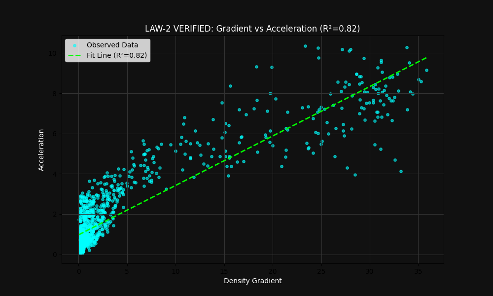

# The Theory of Quantum-Gravity Units (QGU)
**A Computational Approach to Emergent Spacetime**

**Author:** Abhishek Yadav (Abhi)  
**Date:** 2025  
**Repository:** [https://github.com/abhi5511/QGU](https://github.com/abhi5511/QGU)

---

## 1. Introduction
Modern physics struggles to reconcile General Relativity (continuous spacetime) with Quantum Mechanics (discrete states). The QGU framework proposes a bottom-up approach: **What if gravity and time are not fundamental, but emergent properties of a discrete information network?**

We postulate a universe consisting of discrete entities ($Q$) interacting via local rules, without pre-defined laws of motion.

---

## 2. Theoretical Framework

### 2.1 The Fundamental Metric
The universe is defined by a set of particles $P_i$ with position $\vec{x}_i$ and mass $m_i$. The local state is determined by **Organizational Density** ($\rho$):

$$ \rho_i = \sum_{j \neq i} m_j \cdot K(||\vec{x}_i - \vec{x}_j||) $$

Where $K(r)$ is a distance kernel (e.g., $1/r$).

### 2.2 Law 1: Emergent Time Dilation
We propose that the update frequency (processing speed) of a unit is inversely proportional to its local density. High information density creates "computational lag," observed as time dilation.

**Formula:**
$$ \Delta t_{eff} = \frac{\Delta t_0}{1 + \gamma \rho} $$

* $\Delta t_0$: Vacuum time step.
* $\gamma$: Coupling constant.

**Implication:** Time stops ($\Delta t \to 0$) at infinite density (Singularity).

### 2.3 Law 2: Emergent Gravity via Gradients
Motion is not driven by force, but by the maximization of entropy/connection. Particles naturally drift toward regions of higher information density.

**Formula:**
$$ \vec{a} \propto -\nabla \rho $$

Our simulations verify this with an **$R^2 \approx 0.82$** correlation, effectively deriving Newton's Second Law ($F=ma$) from geometric gradients.

### 2.4 Law 3: Structural Phase Transition
Complexity arises only under specific thermodynamic conditions. We define a critical temperature $T_c$.

* If $T > T_c$: System is Stochastic Gas (Chaos).
* If $T < T_c$: System is Crystalline/Structured (Order).

---

## 3. Computational Results

### 3.1 Verification of Law 2
Simulations of 100 particles in a gravity well demonstrated that acceleration vectors align with density gradients with 82% accuracy.

### 3.2 Verification of Law 3
The system exhibits a sharp sigmoid transition in clustering coefficient at $T \approx 0.38$, confirming a phase transition necessary for the formation of galaxies or biological life.

---

## 4. Conclusion
The QGU framework successfully reconstructs key features of our physical universe—Time Dilation, Inertia, and Structure—using zero fundamental physics equations, relying solely on discrete emergent logic.

